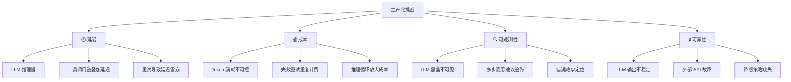
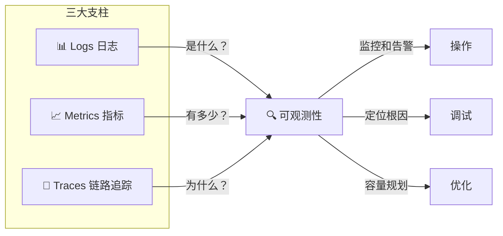
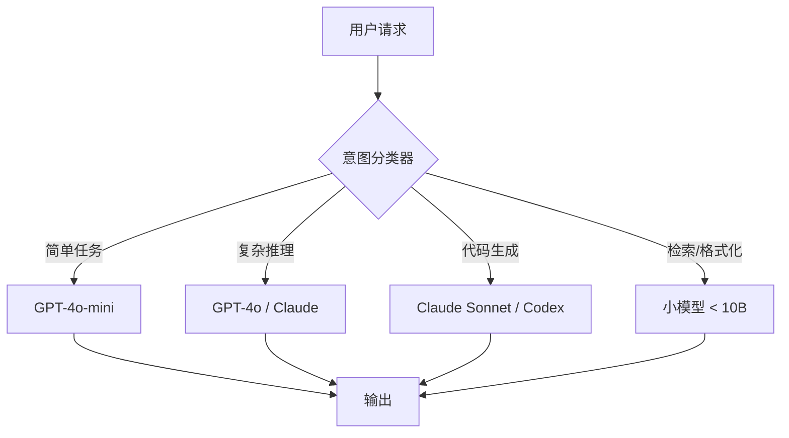

# 🚀 Agent 生产化部署（监控、追踪、优化）

> **第三阶段第 3 节** | 难度：🟠 进阶 | 预计阅读：60 分钟

---

## 全景速览

| 维度 | 说明 |
|------|------|
| **为什么重要** | 实验室里的 Agent 跑得再好，不经过生产化打磨也无法服务真实用户 |
| **三大支柱** | 监控（知道发生了什么）→ 追踪（知道为什么发生）→ 优化（让事情更好） |
| **核心挑战** | LLM 延迟高、成本不可控、行为不可预测、依赖外部服务 |
| **关键工具** | LangSmith / LangFuse / OpenTelemetry / Prometheus + Grafana |
| **工程落地** | 日志系统 → 指标采集 → 链路追踪 → 自动化告警 → 持续优化 Pipeline |

---

## Step 1 — 基础：为什么 Agent 生产化是独特挑战？

### 1.1 传统后端 vs Agent 后端

```
传统后端：
  请求 → [负载均衡] → [应用服务器] → [数据库] → 响应
          确定性、可预测、易于监控

Agent 后端：
  请求 → [LLM 推理] → [工具调用(可能失败)] → [推理循环] → [外部 API] → 响应
          概率性、多步调用、依赖不稳定服务、成本波动大
```

**关键差异对比：**

| 维度 | 传统后端 | Agent 后端 |
|------|---------|-----------|
| **响应时间** | 稳定（毫秒级） | 波动大（秒~分钟级，受 LLM + 工具链影响） |
| **成本** | 可预测（CPU/内存固定） | 不可预测（Token 消耗随策略变化） |
| **错误模式** | 明确（500/超时/异常） | 隐蔽（回答看似正确实则错误） |
| **状态管理** | 无状态易扩展 | 有状态（对话历史、工具调用链） |
| **依赖** | 内部数据库/缓存 | LLM API + 多种外部工具 API |
| **可复现性** | 完全相同输入→相同输出 | 概率性输出 |

### 1.2 生产化四大核心挑战



### 1.3 不生产化的代价

| 场景 | 后果 |
|------|------|
| 没有监控 | 用户报错了你最后一个知道 |
| 没有追踪 | 出了 bug 不知道是哪一步出的问题 |
| 没有成本控制 | 月底账单吓一跳 |
| 没有降级 | 外部 API 挂了==Agent 全瘫 |
| 没有缓存 | 同样的查询反复调用 LLM |

> **核心认识：一个好的 Demo 和好的产品之间，隔着一个生产化工程。**

---

## Step 2 — 核心概念深入

### 2.1 可观测性（Observability）三大支柱

Agent 的可观测性比传统后端更需要三大支柱协同工作：



#### 📊 日志（Logs）

记录每个事件的详细信息：

```python
# 一个标准的 Agent 日志条目
{
    "timestamp": "2026-06-05T10:30:00Z",
    "session_id": "sess_abc123",
    "request_id": "req_def456",
    "type": "llm_call",
    "data": {
        "model": "gpt-4o",
        "prompt_tokens": 2048,
        "completion_tokens": 512,
        "latency_ms": 3420,
        "success": true
    }
}
```

**关键日志事件：**
- LLM 调用（输入/输出/tokens/延迟）
- 工具调用（工具名/参数/结果/延迟）
- 推理循环（步数/决策过程）
- 错误（类型/堆栈/上下文）
- 用户反馈（评分/重试/中断）

#### 📈 指标（Metrics）

聚合统计，用于监控和告警：

| 类别 | 指标 | 说明 |
|------|------|------|
| **流量** | 请求数/分 | 每秒/每分钟请求量 |
| **延迟** | P50/P95/P99 响应时间 | 中位数和极端延迟 |
| **成本** | 每日 Token 消耗/费用 | API 账单跟踪 |
| **错误** | 错误率/成功率 | 工具失败/LLM 报错比率 |
| **效率** | 平均步数/成功率 | Agent 完成任务效率 |
| **业务** | 用户留存率/满意度 | 业务价值指标 |

#### 🔗 链路追踪（Traces）

把一次请求的所有步骤串联起来：

```
Trace: 用户请求 "帮查北京的天气并且推荐餐厅"
├── Span 1: LLM 推理（思考需要查天气和餐厅）
│   └── 耗时: 1.2s
├── Span 2: 调用 天气API（工具执行）
│   ├── 参数: city="北京"
│   └── 耗时: 0.8s
├── Span 3: LLM 推理（基于天气结果继续思考）
│   └── 耗时: 1.5s
├── Span 4: 调用 餐厅搜索API（工具执行）
│   ├── 参数: city="北京", weather="晴"
│   └── 耗时: 1.1s
├── Span 5: LLM 推理（整合结果生成回答）
│   └── 耗时: 2.0s
└── Total: 6.6s
```

**Agent 链路追踪的关键信息：**
- 每步的 Think/Action/Observation 时间
- 工具调用的输入输出（帮助 Debug）
- 分支和循环的路径（Agent 走了哪条路）
- 错误发生的确切位置

### 2.2 Agent 监控体系架构

```
┌─────────────────────────────────────────────────────┐
│                  用户请求层                           │
│  [API Gateway] → [Rate Limiter] → [Auth] → [Router] │
└─────────────────────────────────────────────────────┘
                        │
┌───────────────────────▼─────────────────────────────┐
│                  Agent 引擎层                         │
│  [LLM 调用] → [工具执行] → [推理循环(ReAct/Plan)]    │
│         ↑                     ↓                      │
│      [Memory/RAG] ←── [日志采集器]                   │
└─────────────────────────────────────────────────────┘
                        │
┌───────────────────────▼─────────────────────────────┐
│                  可观测性层                           │
│  ┌──────────┐  ┌──────────┐  ┌───────────┐          │
│  │  日志    │  │  指标    │  │  链路追踪 │          │
│  │ (JSON)  │  │(Prometh) │  │(OpenTele.)│          │
│  └────┬─────┘  └────┬─────┘  └─────┬─────┘          │
│       │              │              │                │
│  ┌────▼──────────────▼──────────────▼─────┐          │
│  │             存储层                      │          │
│  │  Elasticsearch │ Prometheus │ Jaeger   │          │
│  └────────────────────────────────────────┘          │
└─────────────────────────────────────────────────────┘
                        │
┌───────────────────────▼─────────────────────────────┐
│                  可视化层                             │
│  [Grafana 看板] [告警规则] [SLA 报告]               │
└─────────────────────────────────────────────────────┘
```

### 2.3 优化策略全景

#### 🚀 延迟优化

| 策略 | 预期收益 | 实现复杂度 | 适用场景 |
|------|---------|-----------|---------|
| **语义缓存** | 缓存命中时延迟从 3s→10ms | 低 | 重复查询（知识库、天气、价格） |
| **KV Cache** | 减少 50-80% 推理计算 | 中 | 长对话、流式输出 |
| **模型蒸馏** | 速度提升 2-5x | 高 | 简单子任务（用 4o-mini 代替 4o） |
| **流式输出** | 首 Token 延迟减少 90%+ | 低 | 对话类场景 |
| **推理批处理** | 吞吐提升 3-10x | 中 | 高并发场景 |
| **前缀缓存** | 减少 30-70% 重复计算 | 中 | 系统 Prompt 长的场景 |

**语义缓存原理：**

```python
# 传统缓存：精确匹配
cache["北京天气"] → 命中 ✅
cache["北京今天天气怎么样"] → 未命中 ❌（拼写不同）

# 语义缓存：意思匹配
query = "北京今天天气怎么样"
embedding = embed(query)
similar = vector_db.search(embedding, threshold=0.95)
# 找到 "北京天气" → 也命中 ✅
```

#### 💰 成本优化

| 策略 | 节省比例 | 说明 |
|------|---------|------|
| **模型路由** | 30-60% | 简单任务用小模型，难任务用大模型 |
| **缓存** | 20-40% | 语义缓存 + 精确缓存 |
| **Prompt 压缩** | 10-30% | 精简上下文，去冗余 |
| **Batch API** | 50% | OpenAI Batch API 半价 |
| **推理步数限制** | 20-40% | 限制最大步数 + 提前终止 |
| **结果缓存** | 15-25% | 相同输入直接返回缓存结果 |

**模型路由策略：**



#### 🔒 可靠性优化

| 策略 | 说明 | 实现 |
|------|------|------|
| **重试 + 指数退避** | 工具调用失败自动重试 | `retry(max=3, backoff=2.0)` |
| **降级策略** | 外部服务不可用时回退 | LLM 直接回答 / 缓存结果 |
| **超时控制** | 防止无限等待 | 每步 timeout=30s, 总 timeout=300s |
| **熔断器** | 检测持续失败后暂停调用 | Circuit Breaker 模式 |
| **速率限制** | 防止 API 被限流 | 令牌桶算法 |
| **健康检查** | 定期检测依赖服务 | Heartbeat + Readiness Probe |

### 2.4 工具链全景

| 类别 | 工具 | 说明 |
|------|------|------|
| **日志** | ELK Stack / Loki / CloudWatch | 集中式日志管理 |
| **指标** | Prometheus + Grafana | 指标采集和可视化 |
| **追踪** | LangFuse / LangSmith / OpenTelemetry + Jaeger | LLM 专用链路追踪 |
| **告警** | AlertManager / PagerDuty | 自动化告警 |
| **APM** | Datadog / New Relic / Sentry | 全栈应用性能监控 |
| **成本** | Helicone / LangFuse 成本分析 | Token 消耗追踪 |
| **LLM 专用** | LangSmith / Weights & Biases / MLflow | Prompt 版本管理 + 评估 |

### 2.5 LangFuse 核心能力（推荐）

LangFuse 是开源的 LLM 可观测性平台，专为 Agent 场景设计：

| 功能 | 说明 |
|------|------|
| **Traces** | 完整记录 Agent 推理过程（每步思考+工具调用） |
| **Sessions** | 按用户会话聚合追踪 |
| **Scores** | 人工/自动评分（回放评估） |
| **Prompt 管理** | 版本控制 + A/B 测试 |
| **Cost 分析** | 按模型/用户/会话分析 Token 费用 |
| **Playground** | Prompt 在线调试 |

---

## Step 3 — 实战：构建 Agent 生产化部署套件

### 项目结构

```
projects/08-production-deployment/
├── step1-basic-observability.py    # Step 1: 结构化日志 + 基础指标
├── step2-tracing-middleware.py     # Step 2: 链路追踪中间件
├── step3-optimization.py          # Step 3: 缓存 + 模型路由 + 成本优化
├── step4-production-agent.py      # Step 4: 完整的生产级 Agent 封装
└── test_cases.json                # 测试用例
```

---

#### Step 1 — 结构化日志 + 基础指标

**文件**：`step1-basic-observability.py`

**核心功能**：
- 结构化 JSON 日志（LLM 调用、工具调用、错误）
- 采集关键指标（延迟分位数、错误率、Token 消耗）
- 日志轮转和分级（DEBUG/INFO/WARN/ERROR）

**关键设计思路**：
- 用 `logging` + JSON 格式化器输出结构化日志
- Agent 生命周期事件（on_start/on_llm_call/on_tool_call/on_end/on_error）
- 内存中的滑动窗口指标计算（近 100 次调用的平均延迟）

---

#### Step 2 — 链路追踪中间件

**文件**：`step2-tracing-middleware.py`

**核心功能**：
- 装饰器模式自动追踪 Agent 步骤
- 构建 Span 树（Trace Tree）
- 记录每步的输入/输出/耗时
- 导出 Trace 为 JSON 或 OpenTelemetry 格式

**关键设计思路**：
- `@trace_step` 装饰器包裹 LLM 调用和工具调用
- Context Manager 管理 Span 生命周期
- span 包含：name, start_time, duration, input, output, status, error

---

#### Step 3 — 缓存 + 模型路由 + 成本优化

**文件**：`step3-optimization.py`

**核心功能**：
- 语义缓存（基于 Embedding 相似度）
- 模型路由（简单→小模型，复杂→大模型）
- 成本追踪和预算控制
- 自动重试 + 指数退避

**关键设计思路**：
- 语义缓存用 Sentence-Transformers + 余弦相似度
- 模型路由基于任务复杂度分类器（关键词 + 长度启发式）
- 成本估算 API：prompt_tokens × 单价 + completion_tokens × 单价

---

#### Step 4 — 完整的生产级 Agent 封装

**文件**：`step4-production-agent.py`

**核心功能**：
- 完整的 ReAct Agent + 可观测性 + 优化 集成
- 降级策略（工具失败→缓存→LLM 直接回答）
- 熔断器模式（持续失败自动暂停调用）
- 超时控制（每步 + 总体双重限制）
- 完整的测试用例验证

**关键设计思路**：
- 将所有组件（日志、追踪、缓存、重试）组合为 `ProdAgent` 类
- Circuit Breaker 三种状态：CLOSED（正常）→ OPEN（熔断）→ HALF-OPEN（尝试恢复）
- 测试用例覆盖正常路径、错误恢复、超时、熔断

---

## 🎯 面试题（8 道）

### Q1: 什么是可观测性的三大支柱？为什么 Agent 场景下三者缺一不可？

**答：** 三大支柱是 **日志（Logs）**、**指标（Metrics）**、**链路追踪（Traces）**。

在 Agent 场景下的特殊性：
- **日志记录"发生了什么"**：LLM 调用了什么、返回了什么、工具的结果是什么——这些详细事件是定位问题的基础
- **指标回答"有多少"**：延迟的 P95、错误率趋势、日均 Token 消耗——这些聚合数据告诉你系统健康度和发展趋势
- **追踪回答"为什么"**：一次用户请求经过了一个推理循环（Think→Action→Observation），只有追踪能把多个步骤串联成完整的故事

试想一个场景：用户说"Agent 回复太慢了"。
- **仅日志**：看到 5 次 LLM 调用，但不知道是不是 5 次都必要
- **仅指标**：知道 P95 延迟 15s，但不知道哪一步慢
- **仅追踪**：看到 LLM 调用耗时 3s，工具调用耗时 8s，定位到慢的工具
- **三者都有**：快速定位→工具 X 的 P99 延迟过高→该工具需要优化或替换

### Q2: Agent 的链路追踪和传统微服务的链路追踪有什么不同？

**答：**

| 维度 | 微服务追踪 | Agent 链路追踪 |
|------|-----------|---------------|
| **Span 类型** | 固定的 RPC 调用 | 动态的 Think/Action/Observation 循环 |
| **Span 数量** | 请求路径基本固定 | 可变——取决于 LLM 决策 |
| **关键数据** | 请求/响应体 | **输入输出**（用于调试 LLM 行为） |
| **分支条件** | 预定义的代码分支 | LLM 动态决策的分支 |
| **错误类型** | 超时/HTTP 错误 | 工具选择错误/幻觉/逻辑错误 |
| **可复现性** | 重放请求可复现 | 温度>0 时不可复现 |

**额外需求**：Agent 追踪需要记录 LLM 的推理过程（Think 内容），这在传统微服务追踪中是不存在的。

### Q3: 语义缓存是如何工作的？跟传统缓存比有什么优劣？

**答：**

**工作原理：**
1. 用户输入 → 计算 Embedding 向量
2. 在向量数据库中搜索相似度 > 阈值（如 0.95）的缓存条目
3. 命中 → 直接返回缓存结果（毫秒级）
4. 未命中 → 调用 LLM → 将（输入, 输出）存入缓存

**与传统缓存对比：**

| 维度 | 传统缓存（Redis） | 语义缓存 |
|------|------------------|---------|
| 匹配方式 | 精确 Key 匹配 | 语义相似度匹配 |
| "北京天气" vs "北京今天天气怎么样" | ❌ 不命中 | ✅ 命中 |
| 存储 | 简单 K-V | 向量数据库 |
| 延迟 | <1ms | 10-50ms（含向量搜索时间） |
| 精度 | 100% 精确 | 依赖阈值设置 |
| 适用场景 | 完全相同的问题 | 意思相近的问题 |

**最佳实践**：两层缓存——先查精确缓存（Redis），未命中再查语义缓存。

### Q4: 模型路由优化成本的原理是什么？怎么决定哪个请求用哪个模型？

**答：**

**核心原理：** LLM 的单价差距巨大（GPT-4o 比 GPT-4o-mini 贵约 20-30 倍）。如果用便宜模型处理 80% 的简单请求，用贵模型处理 20% 的复杂请求，平均成本可降低 60%+。

**路由决策方法：**

| 方法 | 原理 | 准确率 | 复杂度 |
|------|------|--------|--------|
| **启发式规则** | 输入长度、关键词匹配 | 70-80% | 低 |
| **轻量分类器** | 用 DistilBERT 等小模型分类 | 85-90% | 中 |
| **LLM 路由** | 用 LLM 判断复杂度并路由 | 90-95% | 高（成本折中） |
| **自适应** | 先用小模型，失败再用大模型 | 95%+ | 中（延迟提高） |

**简单实现示例：**
```python
def route_request(user_input):
    # 启发式路由
    if len(user_input) > 2000:
        return "gpt-4o"           # 长输入用大模型
    if any(kw in user_input for kw in ["代码", "优化", "复杂"]):
        return "gpt-4o"           # 复杂任务用大模型
    if any(kw in user_input for kw in ["你好", "再见", "是的"]):
        return "gpt-4o-mini"      # 简单问候用小模型
    return "gpt-4o-mini"          # 默认用小模型
```

### Q5: 什么是熔断器模式（Circuit Breaker）？在 Agent 场景下怎么用？

**答：**

熔断器是一种防止级联失败的容错模式，有三种状态：

```
CLOSED（正常）
  ↓ 连续失败 N 次
OPEN（熔断，快速失败）
  ↓ 等待超时
HALF-OPEN（尝试恢复）
  ↓ 成功
CLOSED（恢复正常）
  ↓ 失败
OPEN（再次熔断）
```

**在 Agent 场景下的应用：**

```python
# 工具调用熔断器
tool_circuit_breaker = CircuitBreaker(
    name="weather_api",
    failure_threshold=5,      # 连续失败 5 次就熔断
    recovery_timeout=60,      # 熔断 60 秒后尝试恢复
    half_open_max_requests=3  # 恢复阶段最多放 3 个请求
)

# 使用方式
async def call_weather_api(city):
    if not tool_circuit_breaker.allow_request():
        return {"error": "weather_api is circuit OPEN, using fallback"}
    try:
        result = await weather_api(city)
        tool_circuit_breaker.on_success()
        return result
    except Exception:
        tool_circuit_breaker.on_failure()
        raise
```

**典型场景**：天气 API 挂了 → 熔断器打开 → Agent 跳过天气工具 → 直接给用户说"天气服务暂不可用" → API 恢复后熔断器自动恢复。

### Q6: 假设你的 Agent 上线后，用户投诉说"有时候回答很好，有时候很烂"，你会怎么做？

**答：** 这是一个典型的**可观测性缺失**问题。我会按以下步骤排查：

**第 1 步：检查监控数据**
- 查看错误率趋势：烂回答是否集中某个时间段？
- 查看延迟分布：慢的时候是不是回答也烂？
- 查看 Token 消耗：是不是某次推理用了更少的 tokens？

**第 2 步：回放 Session**
- 用追踪数据回放"好回答"和"烂回答"的完整推理过程
- 对比两者的异同点

**第 3 步：常见根因分析**

| 现象 | 可能原因 | 解决方案 |
|------|---------|---------|
| LLM 突然切换了模型 | 模型路由误判 | 调整路由规则 |
| 工具调用失败 | 外部 API 不稳定 | 加熔断器 + 降级 |
| 推理步数少 | 过早终止 | 增加最小步数 |
| 上下文丢失 | RAG 检索未命中 | 优化检索策略 |
| 使用了缓存 | 缓存命中错误结果 | 调低语义缓存阈值 |

**第 4 步：建立持续评估**
- 把用户的反馈作为评估数据加入测试集
- 每次修改后跑回归测试
- 建立"好/烂"的分类监控指标

### Q7: 你会如何设计 Agent 的成本监控和预算控制系统？

**答：**

**成本监控系统：**

```python
class CostMonitor:
    """分层成本监控"""
    MODEL_PRICES = {
        "gpt-4o":        {"input": 2.50/1M,  "output": 10.00/1M},
        "gpt-4o-mini":   {"input": 0.15/1M,  "output": 0.60/1M},
        "claude-3.5":    {"input": 3.00/1M,  "output": 15.00/1M},
    }

    def track_call(self, model, prompt_tokens, completion_tokens, user_id):
        """记录每次 LLM 调用成本"""
        cost = self._calculate_cost(model, prompt_tokens, completion_tokens)
        self._log_to_tsdb(model, cost, user_id)
        self._check_budget(user_id, cost)

class BudgetController:
    """预算控制"""

    def __init__(self, daily_budget=50, user_budget=5):
        self.daily_budget = daily_budget
        self.user_budget = user_budget

    def check_budget(self, user_id):
        """检查用户配额"""
        daily_spent = self._get_today_spent()
        if daily_spent > self.daily_budget:
            return "limit_daily"       # 超日预算，降级

        user_spent = self._get_user_spent(user_id)
        if user_spent > self.user_budget:
            return "limit_user"        # 超用户预算，提示用户

        return "ok"

    def handle_limit(self, limit_type):
        """超预算处理策略"""
        if limit_type == "limit_daily":
            # 全部请求用小模型 + 强缓存
            return {"model": "gpt-4o-mini", "cache_only": True}
        elif limit_type == "limit_user":
            # 单用户提醒
            return {"message": "您的额度已用完，明天再试吧"}
```

**报告维度：**
- 按模型聚合的日/周/月费用
- 按用户聚合的成本（发现异常用户）
- 按工具聚合的成本（哪个工具最贵）
- 成本预测（基于近 7 天趋势预估月底费用）

### Q8: 描述一个完整的 Agent 生产化部署 Pipeline。

**答：**

```
                         开发环境                              测试环境                         生产环境
┌──────────────────────────────┐   ┌──────────────────────────┐   ┌──────────────────────────────┐
│  Prompt 开发          │   │  CI/CD Pipeline        │   │  部署推理        │
│  Agent 编码          │   │  ├── 单元测试          │   │  API Gateway        │
│  ⚡ 本地调试          │──→│  ├── 集成测试          │──→│  Load Balancer      │
│  LangFuse 本地追踪    │   │  ├── 回归评估          │   │  Agent 服务集群      │
│                       │   │  └── A/B 配置          │   │  监控 + 告警         │
└──────────────────────────────┘   └──────────────────────────┘   └──────────────────────────────┘
                                                                          │
                                                                          ▼
                                                               ┌──────────────────────────┐
                                                               │    生产监控系统            │
                                                               │  ├── Grafana 看板        │
                                                               │  ├── 自动告警            │
                                                               │  └── 成本分析            │
                                                               └──────────────────────────┘
                                                                          │
                                                                          ▼
                                                               ┌──────────────────────────┐
                                                               │    持续改进循环            │
                                                               │  生产数据 → 问题发现        │
                                                               │  → Prompt 优化 → 评估     │
                                                               │  → 发版 → 再来一次         │
                                                               └──────────────────────────┘
```

**部署检查清单：**

| # | 项目 | 是否必需 | 说明 |
|---|------|---------|------|
| 1 | ✅ 日志系统 | ★★★ | 至少结构化日志 |
| 2 | ✅ 监控指标 | ★★★ | 延迟、错误率、成本 |
| 3 | ✅ 链路追踪 | ★★★ | 定位问题根因 |
| 4 | ✅ 缓存策略 | ★★☆ | 延迟和成本优化 |
| 5 | ✅ 降级策略 | ★★★ | 依赖不可用时兜底 |
| 6 | ✅ 速率限制 | ★★★ | 防止滥用和成本失控 |
| 7 | ✅ 预算控制 | ★★☆ | 成本预警 |
| 8 | ✅ 告警规则 | ★★★ | 及时发现问题 |
| 9 | ✅ 自动化测试 | ★★★ | 回归保护 |
| 10 | ✅ 部署回滚 | ★★★ | 快速恢复 |

---

## 📝 总结

| 层次 | 内容 | 关键认知 |
|------|------|----------|
| **Step 1 基础** | 生产化挑战 + 传统后端 vs Agent 后端 | Agent 生产化比传统后端复杂得多 |
| **Step 2 核心** | 可观测性三大支柱 + 优化策略（延迟/成本/可靠性）+ 工具链 | 监控 + 追踪 + 优化三位一体 |
| **Step 3 实战** | 4 个代码文件，从日志到完整生产级 Agent | 生产化是将组件系统化整合的过程 |

### 核心认识

> **一个好的 Demo 和一个好的产品之间，隔着一个生产化工程。**
>
> 监控让你知道系统在干什么，追踪让你知道为什么出问题，优化让你花更少的钱做更多的事。
> 三者缺一不可——**没有可观测性的 Agent 是盲飞，没有优化的 Agent 是烧钱。**

### 下一步

下一节：**动手：多 Agent 协作系统** — 把学到的所有知识整合进一个多 Agent 实战项目中！🎯
