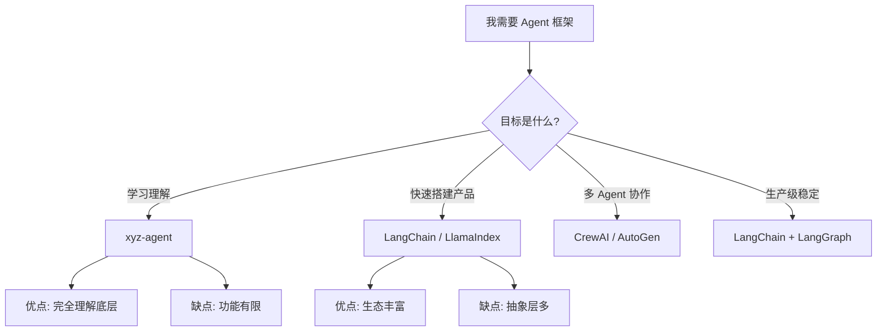

# notes-15-build-framework.md

> **第四阶段第 1 节：构建自己的 Agent 框架/库**
>
> 从零到一地构建一个轻量级 AI Agent 框架——`xyz-agent`
>
> 渐进式三步递进法：ReAct 引擎 → 工具+记忆系统 → 多 Agent 编排 + CLI 封装

---

## 目录

1. [为什么自己构建框架？](#1-为什么自己构建框架)
2. [框架设计概览](#2-框架设计概览)
3. [Step 1：ReAct 循环引擎](#3-step-1react-循环引擎)
4. [Step 2：工具系统 + 记忆系统](#4-step-2工具系统--记忆系统)
5. [Step 3：多 Agent 编排 + CLI 封装](#5-step-3多-agent-编排--cli-封装)
6. [框架完整性验证](#6-框架完整性验证)
7. [与主流框架对比](#7-与主流框架对比)
8. [总结与展望](#8-总结与展望)

---

## 1. 为什么自己构建框架？

| 理由 | 说明 |
|------|------|
| 🎯 **深度理解** | 用别人的框架是使用，自己写才是真正理解 Agent 的工作原理 |
| 🧱 **最小化** | 只包含你需要的核心功能，没有多余依赖 |
| 🔌 **完全控制** | 可以按自己的方式设计 API、扩展模块 |
| 📚 **学习价值** | 这是从 Agent 用户到 Agent 构建者的质变 |
| 🏗️ **生产准备** | 理解了底层，才能更好地使用和排错主流框架 |

### 框架设计原则

```
1. 🧱 模块化   — 引擎、工具、记忆、多 Agent 各自独立，可插拔
2. 🔌 接口统一 — 每个模块有清晰的抽象基类
3. 🎯 轻量无依赖 — 核心引擎只依赖 Python 标准库
4. 📈 渐进式复杂度 — 从最小可用版开始，逐步扩展
```

### 架构全景

```
┌──────────────────────────────────────────────────────────┐
│                    xyz-agent v0.1.0                       │
│                                                          │
│  ┌─────────────┐  ┌────────────┐  ┌─────────────────┐   │
│  │   engine    │  │    tool    │  │    memory        │   │
│  │  ReAct 循环  │  │  工具系统   │  │  记忆系统         │   │
│  │             │  │           │  │                  │   │
│  │ · Thought   │  │ · @tool   │  │ · 短期 (Buffer)  │   │
│  │ · Action    │  │ · 注册表   │  │ · 长期 (File)    │   │
│  │ · Observe   │  │ · 参数校验 │  │ · RAG (TF-IDF)  │   │
│  │ · Step()    │  │ · MCP     │  │ · 混合管理器      │   │
│  └──────┬──────┘  └─────┬─────┘  └────────┬────────┘   │
│         │               │                  │            │
│  ┌──────┴───────────────┴──────────────────┴─────────┐  │
│  │               orchestrator                         │  │
│  │        多 Agent 编排引擎                           │  │
│  │    (编排式 / 辩论式 / 流水线)                       │  │
│  └───────────────────┬─────────────────────────────────┘  │
│                      │                                    │
│  ┌───────────────────┴─────────────────────────────────┐  │
│  │              agent (高级封装层)                       │  │
│  │        · Agent.run() · Agent.chat()                  │  │
│  │        · 会话管理 · 配置系统                          │  │
│  │        · 组件注入（工具+记忆）                        │  │
│  └───────────────────┬─────────────────────────────────┘  │
│                      │                                    │
│  ┌───────────────────┴─────────────────────────────────┐  │
│  │                cli                                   │  │
│  │     · xyz-agent run / chat / tools                   │  │
│  └──────────────────────────────────────────────────────┘  │
└──────────────────────────────────────────────────────────┘
```

### 文件结构

```
projects/xyz-agent/
├── xyz_agent/
│   ├── __init__.py      # 包入口 + 版本号
│   ├── engine.py        # ReAct 循环引擎
│   ├── agent.py         # Agent 高级封装
│   ├── tool.py          # 工具系统
│   ├── memory.py        # 记忆系统
│   ├── orchestrator.py  # 多 Agent 编排引擎
│   └── cli.py           # CLI 接口
├── step1-engine-demo.py      # Step 1 演示
├── step2-tool-memory-demo.py # Step 2 演示
├── step3-orchestrator-demo.py # Step 3 演示
├── setup.py                  # pip 安装配置
├── requirements.txt
└── README.md
```

---

## 2. 框架设计概览

### 关键技术决策

| 决策 | 选择 | 理由 |
|------|------|------|
| 核心循环 | ReAct | 最成熟的 Agent 设计模式，简单可扩展 |
| 引擎风格 | 纯函数式核心 | 易于测试、可中断可恢复 |
| 工具注册 | 装饰器 + 注册表 | Pythonic、类型安全、自动生成 schema |
| 记忆系统 | 三层分级 | 短期对话 / 重要知识 / 文档检索 |
| 编排模式 | 3 种模式 | 覆盖最常见的多 Agent 协作场景 |
| CLI | 纯标准库 | 零依赖，后续可加 click |

### 命名与包结构

- **包名**: `xyz-agent`（通过 pip 安装）
- **源码包**: `xyz_agent`（Python import）
- **CLI 命令**: `xyz-agent`（pip 安装后自动注册）

### 核心接口契约

```python
# LLM 提供者接口
def llm_call(prompt: str, messages: list) -> tuple[str, int]:
    """接收 prompt 和上下文，返回 (response_text, token_count)"""

# 工具执行接口
def tool_executor(name: str, args: dict) -> str:
    """执行工具，返回字符串结果"""

# Agent 工厂接口
def create_agent(name: str, role: str) -> Agent:
    """创建命名 Agent，用于编排引擎"""
```

---

## 3. Step 1：ReAct 循环引擎

### 核心概念

ReAct = **Re**asoning + **Act**ion，是 Google 和普林斯顿大学提出的 Agent 设计模式。

```
循环流程:
                    ┌──────────────┐
                    │   用户问题    │
                    └──────┬───────┘
                           ▼
                    ┌──────────────┐
                    │   思考(Thought)   │
                    │   "我需要查天气"  │
                    └──────┬───────┘
                           ▼
                    ┌──────────────┐
                    │   动作(Action)    │
                    │   get_weather()   │
                    └──────┬───────┘
                           ▼
                    ┌──────────────┐
                    │  观察(Observation)│
                    │   "晴, 25°C"      │
                    └──────┬───────┘
                           ▼
                    还有需要？──→ 继续循环
                           │
                           ▼ 否
                    ┌──────────────┐
                    │  最终答案     │
                    └──────────────┘
```

### 引擎设计

```python
# 核心引擎（engine.py）
class ReActEngine:
    def __init__(self, llm_call, tool_executor, config):
        ...

    def run(self, question: str) -> str:
        """完整循环"""
        self.reset(question)
        while not self.done:
            self.step()
        return self.final_answer

    def step(self) -> Step:
        """单步执行"""
        response, tokens = self.llm_call(prompt, messages)
        step = self._parse_response(response)

        if step.type == ActionType.TOOL:
            tool_result = self.tool_executor(name, args)
            step.tool_result = tool_result

        elif step.type == ActionType.ANSWER:
            self.done = True
            self.final_answer = step.content

        return step
```

### 设计要点

1. **双模式运行**：`run()` 自动循环 vs `step()` 单步控制
2. **响应解析**：通过正则提取"动作: + 参数:" 格式
3. **工具调用计数**：防止无限循环
4. **Token 追踪**：每次 LLM 调用记录 token 数
5. **获取追踪**：`get_trace()` 返回结构化步骤列表可用于调试

### 高级封装

```python
# Agent 封装（agent.py）
class Agent:
    def __init__(self, llm_provider, tools, config):
        self.engine = ReActEngine(...)

    def run(self, question: str) -> str:
        """单次运行"""
        return self.engine.run(question)

    def chat(self, message: str) -> str:
        """多轮对话"""
        return self.engine.run(message)

    def get_stats(self) -> dict:
        """获取统计"""
        return self.engine.get_stats()
```

---

## 4. Step 2：工具系统 + 记忆系统

### 4.1 工具系统 (`tool.py`)

#### 设计模式：装饰器 + 注册表

```python
# 方式一：装饰器
registry = ToolRegistry()

@registry.register
def get_weather(city: str) -> str:
    """查询城市天气"""
    return f"{city}: 晴, 25°C"

# 方式二：手动注册（自定义参数描述）
registry.register_fn(
    name="translate",
    fn=translate_text,
    description="翻译文本",
    parameters={
        "type": "object",
        "properties": {
            "text": {"type": "string"},
            "target_lang": {"type": "string", "enum": ["zh", "en"]},
        },
        "required": ["text"],
    },
)

# 方式三：MCP 格式
registry.register_mcp(
    name="search",
    fn=search_fn,
    schema={"description": "搜索", "inputSchema": {...}},
)
```

#### 核心特性

| 特性 | 实现方式 | 说明 |
|------|----------|------|
| 自动参数推断 | `inspect.signature` + `get_type_hints` | 从函数签名生成 JSON Schema |
| 参数校验 | 检查 required 参数是否存在 | 执行前验证 |
| OpenAI 兼容 | `get_openai_tools()` | 直接对接 Function Calling |
| 安全执行 | `execute_safe()` | 异常不中断，返回错误信息 |
| 类型映射 | `str→string, int→integer` | Python 类型到 JSON Schema |

### 4.2 记忆系统 (`memory.py`)

#### 三层架构

```
┌─────────────────────────────────────────────────┐
│                 MemorySystem                      │
│                    (混合管理器)                     │
├────────────────────┬────────────────────────────┤
│                    │                            │
│   ShortTermMemory  │   LongTermMemory          │
│   (环形缓冲区)       │  (JSON 文件持久化)          │
│                    │                            │
│   · max 条消息      │   · 内容哈希去重             │
│   · 自动摘要压缩     │   · 重要性评分 (0.3 阈值)    │
│   · 按角色过滤      │   · LRU 淘汰机制             │
│   · 上下文构建       │   · 自动保存                │
├────────────────────┴────────────────────────────┤
│                    │                            │
│   RAGMemory                                     │
│   (TF-IDF 检索)                                  │
│                                                  │
│   · 内嵌 TF-IDF（零依赖）                         │
│   · 文档分块管理                                  │
│   · 中文/英文混合分词                              │
│   · 可对接外部向量数据库                           │
└──────────────────────────────────────────────────┘
```

#### 记忆系统关键代码

```python
# 短期记忆
mem = ShortTermMemory(max_messages=50)
mem.add_message("user", "你好")
mem.get_context()     # 构建 LLM 上下文
mem.search("天气")     # 关键词搜索

# 长期记忆
ltm = LongTermMemory(file_path="memory.json")
ltm.add("重要知识", importance=0.8)
ltm.get_important()   # 获取高优先级记忆

# RAG 记忆
rag = RAGMemory()
rag.add(doc_text)
rag.search("AI Agent")  # TF-IDF 检索

# 混合使用
ms = MemorySystem()
ms.add_conversation("user", "你好")
ms.add_knowledge("用户偏好", importance=0.7)
ms.add_document("知识文档")
ms.get_context("当前问题")  # 自动融合多级记忆
```

---

## 5. Step 3：多 Agent 编排 + CLI 封装

### 5.1 多 Agent 编排 (`orchestrator.py`)

#### 三种协作模式

```python
orch = Orchestrator(create_agent_fn)

# 1. 编排式：Supervisor 分解 + Workers 执行
result = orch.run(
    goal="写学习路线图",
    agents=["researcher", "writer", "reviewer"],
    mode=CollabMode.ORCHESTRATED,
)

# 2. 辩论式：多 Agent 轮流发表观点
result = orch.run(
    goal="AI 伦理问题",
    agents=["proponent", "opponent"],
    mode=CollabMode.DEBATE,
)

# 3. 流水线：上一个输出是下一个输入
result = orch.run(
    goal="开发一个 App",
    agents=["planner", "developer", "tester"],
    mode=CollabMode.PIPELINE,
)
```

#### 模式对比

| 模式 | 适用场景 | 优点 | 缺点 |
|------|----------|------|------|
| 编排式 | 复杂任务分解 | 结构化、可追踪 | 依赖 Supervisor 质量 |
| 辩论式 | 需要多角度讨论 | 覆盖更多观点 | 可能无法达成共识 |
| 流水线 | 链式处理流程 | 简单直接 | 前一步错误会传播 |

#### 共享黑板模式

```python
# Orchestrator 内部维护共享黑板
self.blackboard = {
    "goal": goal,
    "context": context or "",
    # 每个 Agent 执行后写入
    f"{agent_name}_result": result[:200],
}

# 后续 Agent 可以看到前面的结果
prompt += f"\n黑板信息:\n{json.dumps(self.blackboard)}"
```

### 5.2 CLI 封装 (`cli.py`)

```bash
# 安装后可用
pip install -e .

# CLI 命令
xyz-agent run "北京的天气如何？"   # 单次运行
xyz-agent chat                     # 交互式对话
xyz-agent tools                    # 列出工具
xyz-agent config                   # 查看配置
xyz-agent version                  # 版本信息
```

### 5.3 pip 安装

```bash
# 开发者安装
cd projects/xyz-agent
pip install -e .

# 可选依赖
pip install xyz-agent[cli]    # + click (CLI)
pip install xyz-agent[llm]    # + openai (LLM)
pip install xyz-agent[rag]    # + chromadb (向量检索)
pip install xyz-agent[all]    # 全部
```

---

## 6. 框架完整性验证

### 模块验证结果

| 模块 | 文件 | 行数 | 状态 |
|------|------|:----:|:----:|
| 包入口 | `__init__.py` | ~20 | ✅ |
| ReAct 引擎 | `engine.py` | ~230 | ✅ |
| Agent 封装 | `agent.py` | ~130 | ✅ |
| 工具系统 | `tool.py` | ~230 | ✅ |
| 记忆系统 | `memory.py` | ~380 | ✅ |
| 编排引擎 | `orchestrator.py` | ~250 | ✅ |
| CLI 接口 | `cli.py` | ~120 | ✅ |

### 演示运行

```bash
# Step 1：引擎演示（4 个场景）
python step1-engine-demo.py
# => 基础问答 / 工具调用 / 单步模式 / Agent API

# Step 2：工具+记忆演示（7 个场景）
python step2-tool-memory-demo.py
# => 装饰器注册 / 手动注册 / 默认注册表
# => 短期记忆 / 长期记忆 / RAG / 混合记忆

# Step 3：编排+CLI 演示（5 个场景）
python step3-orchestrator-demo.py
# => 编排式 / 辩论式 / 流水线 / CLI / pip install
```

---

## 7. 与主流框架对比

| 特性 | xyz-agent | LangChain | CrewAI | AutoGen |
|------|:---------:|:---------:|:------:|:-------:|
| 核心依赖 | 标准库 | 多 | 轻量 | 中等 |
| 代码行数 | ~1,200 | ~100,000+ | ~10,000+ | ~20,000+ |
| ReAct 循环 | ✅ 原生 | ✅ | ⬜ | ✅ |
| 工具系统 | ✅ 自定义 | ✅ 丰富 | ✅ 有限 | ✅ |
| 记忆系统 | ✅ 三层 | ✅ 复杂 | ✅ 基础 | ⬜ |
| 多 Agent | ✅ 3 种模式 | ❌ 需扩展 | ✅ 角色式 | ✅ 对话式 |
| CLI | ✅ 内置 | ✅ 可选 | ❌ | ❌ |
| pip 安装 | ✅ | ✅ | ✅ | ✅ |
| 学习成本 | 极低 | 高 | 中 | 中高 |
| 定位 | 学习+轻量 | 生产级 | 多Agent | 研究型 |

### 框架决策流程图



### 什么时候用 xyz-agent？

- ✅ 你想**深度理解** Agent 工作原理
- ✅ 你的项目只需要**核心 Agent 功能**（ReAct + 工具 + 记忆）
- ✅ 你不想引入**大量依赖**
- ✅ 作为**教学工具**学习 Agent 框架设计
- ❌ 需要用大量社区工具和集成（→ LangChain）
- ❌ 需要企业级多 Agent 系统（→ CrewAI）

---

## 8. 总结与展望

### 本节课学到了什么？

1. **Agent 框架的核心组成**：引擎、工具、记忆、编排、CLI
2. **ReAct 循环的完整实现**：思考→行动→观察的每一步
3. **工具系统的设计模式**：装饰器+注册表+自动 schema 生成
4. **三层记忆架构**：短期/长期/RAG 如何协同工作
5. **多 Agent 协作模式**：编排式、辩论式、流水线
6. **框架打包与 CLI 封装**：从源码到 pip 安装

### xyz-agent 后续扩展方向

```
v0.2.0 — 真实 LLM 集成
├── OpenAI / Anthropic / 本地模型适配器
├── Streaming 输出
└── 错误重试 + 退避策略

v0.3.0 — 高级特性
├── MCP 协议支持（工具发现+注册）
├── 记忆持久化（SQLite / Redis）
└── Agent 监控仪表板

v0.4.0 — 生产就绪
├── LangFuse / OpenTelemetry 集成
├── 分布式多 Agent
├── 缓存系统（语义缓存）
└── 安全过滤（输入/输出）
```

### 代码引用速查

| 功能 | 文件 | 关键类/函数 |
|------|------|-------------|
| ReAct 引擎 | `engine.py` | `ReActEngine.run()` / `.step()` |
| Agent API | `agent.py` | `Agent.run()` / `.chat()` |
| 工具注册 | `tool.py` | `@tool` / `ToolRegistry.register()` |
| 记忆系统 | `memory.py` | `ShortTermMemory` / `LongTermMemory` / `RAGMemory` |
| 多 Agent | `orchestrator.py` | `Orchestrator.run()` |
| CLI | `cli.py` | `main()` / `cmd_run()` |

### 面试题

1. **ReAct 循环的核心步骤是什么？如何防止无限循环？**
   - 三步：Thought → Action → Observation
   - 通过 max_steps、max_tool_calls、timeout 三重限制

2. **工具注册表中装饰器和手动注册各有什么优缺点？**
   - 装饰器：简洁，自动推断参数类型；但无法自定义参数描述（enum/description）
   - 手动注册：灵活，可精确控制每个参数；但代码量更大

3. **短期记忆和 RAG 记忆有什么区别？什么时候用哪个？**
   - 短期：会话内上下文，快速读写，容量有限
   - RAG：知识检索，支持大规模文档，需要索引
   - 规则：对话上下文用短期，知识库用 RAG

4. **多 Agent 编排式中 Supervisor 如何分解任务？**
   - 简单分配：按 Agent 数量平分
   - 高级分配：根据 Agent 的角色描述智能分配

5. **为什么我们的核心引擎零外部依赖？有什么好处？**
   - 纯标准库实现，无需 pip install 即可运行
   - 好处：无版本冲突、无兼容问题、可嵌入任何项目

---

> **项目地址**: `projects/xyz-agent/`
>
> **运行命令**: `cd projects/xyz-agent && python step3-orchestrator-demo.py`
>
> **相关笔记**: notes-06 Agent 设计模式 | notes-07 工具调用 | notes-08 记忆系统 | notes-09 多 Agent 协作
