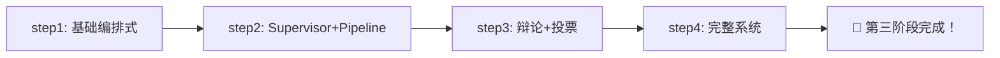

# 🏗️ 多 Agent 协作系统（实战项目）

> 第三阶段 · 第 4 节 · 动手实战

本目录从零到一搭建了一个完整的**多 Agent 协作系统**，融合了之前学到的评估（notes-11）、安全（notes-12）、生产化部署（notes-13）等全部知识。

## 学习路线



## 文件说明

| 文件 | 难度 | 核心内容 |
|------|------|---------|
| `step1-basic-multi-agent.py` | ⭐ | Controller + 3 个 Worker 的最简编排式协作 |
| `step2-supervisor-pipeline.py` | ⭐⭐ | Supervisor 监督者 + Pipeline 串联 + 黑板模式 |
| `step3-debate-and-voting.py` | ⭐⭐⭐ | 辩论模式 + 投票模式 + 仲裁机制 |
| `step4-full-system.py` | ⭐⭐⭐⭐ | **完整系统**：评估+安全+监控+成本追踪 |

## 技术栈

- **LLM**: OpenAI API（兼容，可替换）
- **通信**: 结构化消息 + 黑板模式
- **评估**: LLM-as-Judge
- **安全**: 输入注入检测 + 输出 PII 过滤
- **监控**: 结构化 JSON 日志 + Metrics 统计

## 系统架构（Step 4）

```
用户输入 → 安全检测 → Supervisor 分解任务 → Pipeline 执行
    → 架构师(设计) → 开发者(编码) → 测试(验证)
    → 质量评估(LLM-as-Judge) → 安全检测(输出) → 最终报告
```

## 运行

```bash
export OPENAI_API_KEY="your-key-here"
export OPENAI_BASE_URL="https://api.openai.com/v1"

# 也可以设置 .env 文件

python step1-basic-multi-agent.py   # 最简版
python step2-supervisor-pipeline.py # Pipeline 版
python step3-debate-and-voting.py   # 辩论+投票
python step4-full-system.py         # 完整系统
```

## 为什么不用框架？

本项目的所有 Agent 系统都是用纯 Python 从零构建的，没有依赖 LangChain、CrewAI、AutoGen 等框架。

**原因**：理解底层原理比学会用框架更重要。理解了这些基础，用任何框架都很快上手。
